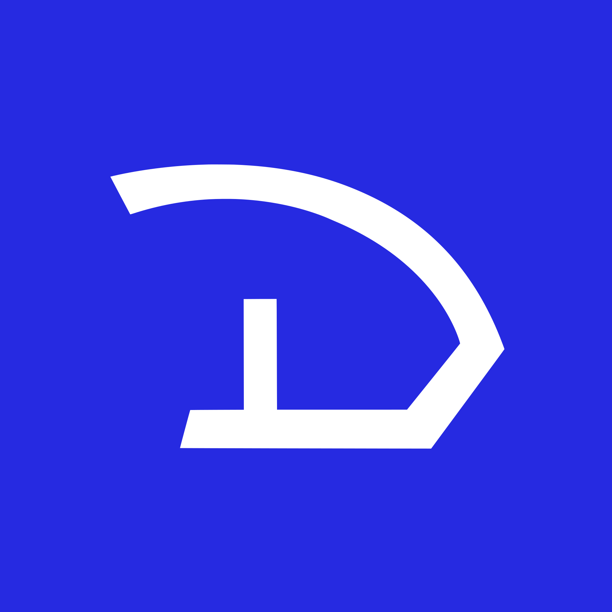

  

    
    
 🥰 

  

  <h1 class="element">DvdBr3o</h1>
  <h4 class="element">一个天天想她的白痴</h4>

---

<h2> ⚒️ 技术栈 </h2>

- 啥也不会

- 会点 `C++`

<h2> ✅ 正在做 </h2>

- 基于 `C++20` template / `Vulkan` 的 modern GUI 框架

- 借鉴 `coffeescript` 并兼容 `lua` 的面向配置的脚本语言

- 基于前两者的音乐宿主 DAW

~~(以上永远不会实现)~~

<h2> ❤️ 喜欢 </h2>

- 💻 学点 `C++`

- 🎶 一点点电子音乐 ⊇ {(Botanica, Hyper, Riddim, Kawaii, Pop)}

- 🖼️ 一点点 art

- 🕹️ COD ~~(买不起本体所以特指 Warzone 😅)~~

- 💌 她
  
<h2> 🔗 更多の我 </h2>

