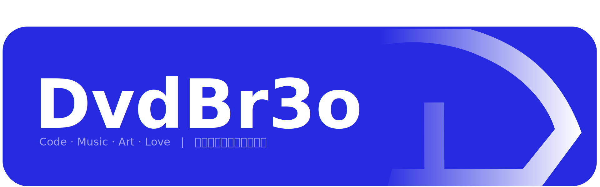

---

## ⚒️ 技术栈

- 啥也不会

- 会点 `C++`

## ✅ 正在做

- 基于 `C++20` template / `Vulkan` 的 modern GUI 框架

- 借鉴 `coffeescript` 并兼容 `lua` 的面向配置的脚本语言

- 基于前两者的音乐宿主 DAW

~~(以上永远不会实现)~~

## ❤️ 喜欢

- 💻 学点 `C++`

- 🎶 一点点电子音乐 ⊇ { Botanica, Hyper, Riddim, Kawaii, Pop, Trap }

- 🖼️ 一点点 art

- 🕹️ COD ~~(买不起本体所以特指 Warzone 😅)~~

- 💌 她
  
## 🔗 更多の我

